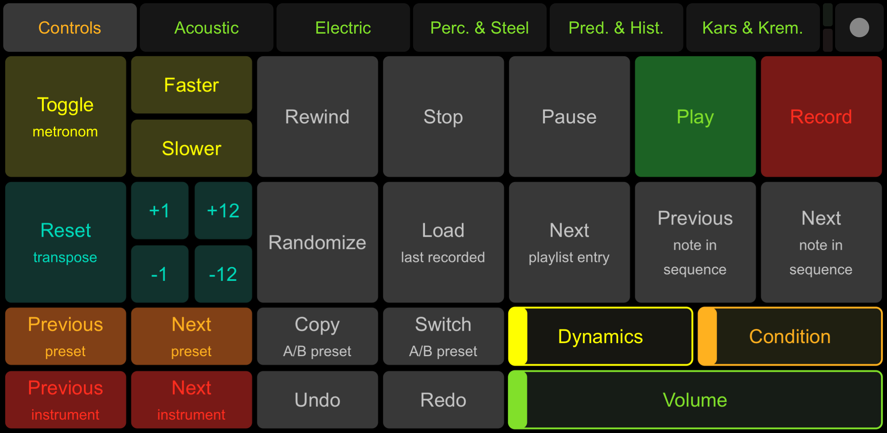
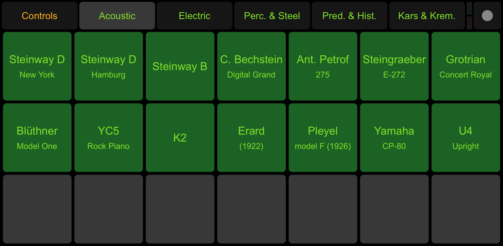
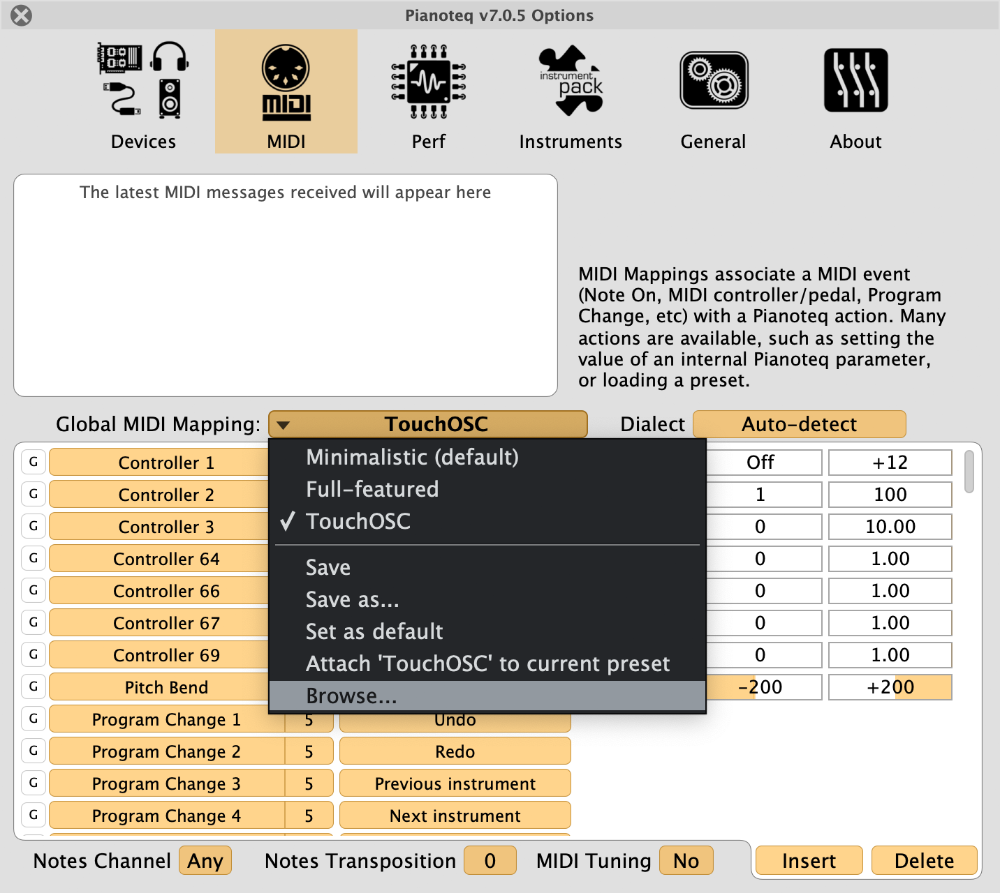

# TouchOSC for Pianoteq

This is a [TouchOSC](https://hexler.net/products/touchosc) layout to control [Pianoteq](https://www.modartt.com/pianoteq).

## Screenshots

**Controls** page:  

**Acoustic** page:  

## Setup

### TouchOSC

1. Install TouchOSC app:  
   https://hexler.net/products/touchosc#get

2. Sync Pianoteq layout to your mobile device:

   > **Note:** This step is only required as long as the Pianoteq layout is not shipped directly with the TouchOSC app.

   1. Install TouchOSC editor:  
      https://hexler.net/products/touchosc#resources

   2. Download TouchOSC layout:  
      [Pianoteq.touchosc](Pianoteq.touchosc)

   3. Open TouchOSC layout `Pianoteq.touchosc` with TouchOSC editor and sync it to your mobile device as described here:  
      https://hexler.net/docs/touchosc-editor-sync

3. Setup TouchOSC connection as described here:  
   https://hexler.net/docs/touchosc-configuration-connections

   > **Note:** I recommend to use *TouchOSC Bridge*, because it was the easiest way for me to get a connection running. Use *CoreMIDI* on macOS if you do not want to install any additional software.

### Pianoteq

1. Activate the TouchOSC midi input (as configured above):

      - Open the `Devices` page in the Pianoteq options.
      - Activate the TouchOSC MIDI input next to `Active MIDI inputs`.

2. Install MIDI mapping:

   > **Note:** This step is only required as long as the MIDI mapping is not shipped directly with Pianoteq.

   - Download MIDI mapping:  
     [TouchOSC.ptm](TouchOSC.ptm)

   - Copy MIDI mapping `TouchOSC.ptm` to the `MidiMappings` folder.

     To find the `MidiMappings` folder:
      
     - Open the `MIDI` page in the Pianoteq options.
     - Open the `Global MIDI Mapping` dropdown.
     - Click on `Browse...` (see screenshot below).

   - Load the Pianoteq MIDI mapping `TouchOSC` (see screenshot below).

     
